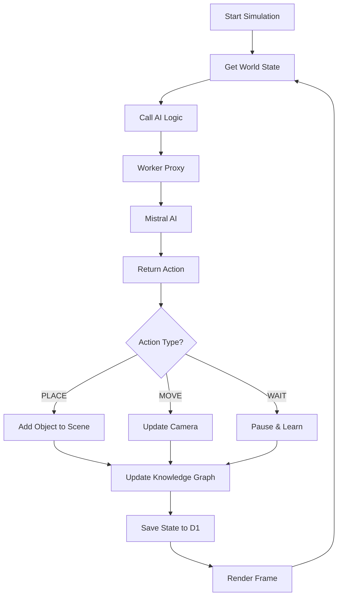

# 🏗️ World26 Architecture

## System Overview

```
┌─────────────────────────────────────────────────────────────────┐
│                         USER'S BROWSER                          │
│                                                                 │
│  ┌───────────────────────────────────────────────────────────┐ │
│  │           GitHub Pages (Static Hosting)                   │ │
│  │                                                           │ │
│  │  ┌─────────────┐  ┌──────────────┐  ┌─────────────┐    │ │
│  │  │  React App  │  │ Three.js 3D  │  │ UI Controls │    │ │
│  │  │  (World26)  │  │  Simulation  │  │  & Graphs   │    │ │
│  │  └──────┬──────┘  └──────────────┘  └─────────────┘    │ │
│  │         │                                                │ │
│  │         │ services/aiLogic.ts                          │ │
│  │         │ fetch(VITE_PROXY_URL)                        │ │
│  └─────────┼───────────────────────────────────────────────┘ │
│            │                                                  │
└────────────┼──────────────────────────────────────────────────┘
             │
             │ HTTPS Request
             │ POST /v1/chat/completions
             │ { messages: [...] }
             ↓
┌─────────────────────────────────────────────────────────────────┐
│                    CLOUDFLARE EDGE NETWORK                      │
│                                                                 │
│  ┌───────────────────────────────────────────────────────────┐ │
│  │           Cloudflare Worker (API Proxy)                   │ │
│  │           temp_mistralapicaller/                          │ │
│  │                                                           │ │
│  │  ┌──────────────────────────────────────────────────┐   │ │
│  │  │  Hono.js Router                                  │   │ │
│  │  │  - GET  /          → Health Check               │   │ │
│  │  │  - POST /v1/chat/completions → AI Proxy         │   │ │
│  │  │  - GET  /state     → Load State                 │   │ │
│  │  │  - POST /state     → Save State                 │   │ │
│  │  │                                                  │   │ │
│  │  │  🔐 Environment Variables:                      │   │ │
│  │  │     MISTRAL_API_KEY (secret)                    │   │ │
│  │  └──────────────────────────────────────────────────┘   │ │
│  │                                                           │ │
│  │  ┌──────────────────────────────────────────────────┐   │ │
│  │  │  D1 Database (SQLite at Edge)                   │   │ │
│  │  │  - Simulation state persistence                 │   │ │
│  │  │  - Historical data storage                      │   │ │
│  │  └──────────────────────────────────────────────────┘   │ │
│  └───────────────────────────────────────────────────────────┘ │
│            │                                                  │
└────────────┼──────────────────────────────────────────────────┘
             │
             │ HTTPS Request with API Key
             │ Authorization: Bearer ${MISTRAL_API_KEY}
             ↓
┌─────────────────────────────────────────────────────────────────┐
│                        MISTRAL AI API                           │
│                    api.mistral.ai                               │
│                                                                 │
│  - Large Language Model (mistral-large-latest)                 │
│  - Chat Completions Endpoint                                   │
│  - Architect-OS Intelligence Processing                        │
└─────────────────────────────────────────────────────────────────┘
```

---

## 🔄 Request Flow

### 1. AI Decision Request

```
User clicks "Start Simulation"
    ↓
React App (App.tsx) calls decideNextAction()
    ↓
services/aiLogic.ts prepares system instruction + prompt
    ↓
fetch(VITE_PROXY_URL, { method: 'POST', body: {...} })
    ↓
Request leaves browser to Cloudflare Worker
    ↓
Worker adds MISTRAL_API_KEY header
    ↓
Worker forwards to Mistral AI API
    ↓
Mistral returns AI response
    ↓
Worker returns response to browser
    ↓
React App processes action (PLACE, MOVE, WAIT)
    ↓
Three.js renders 3D object in scene
```

### 2. State Persistence

```
Simulation generates new object
    ↓
React App periodically calls saveState()
    ↓
POST /state with worldObjects array
    ↓
Worker saves to D1 database
    ↓
State stored in SQLite at Cloudflare Edge
    ↓
On page reload, GET /state retrieves it
```

---

## 🔐 Security Architecture

### API Key Protection

```
❌ WITHOUT Proxy (Insecure):
Browser → Mistral AI (API key visible in browser!)

✅ WITH Proxy (Secure):
Browser → Cloudflare Worker → Mistral AI
         (API key hidden)
```

### Key Security Features:

| Feature | Implementation | Benefit |
|---------|---------------|---------|
| **Secret Storage** | Cloudflare Worker Secrets | API key never in source code |
| **CORS Headers** | Worker adds `Access-Control-Allow-Origin: *` | No browser errors |
| **Rate Limiting** | Cloudflare WAF (optional) | Prevent abuse |
| **Edge Execution** | 300+ global locations | Low latency |
| **DDoS Protection** | Cloudflare infrastructure | Built-in security |

---

## 📦 Components

### Frontend (GitHub Pages)
- **Location:** `https://username.github.io/world26/`
- **Tech:** React + TypeScript + Three.js + Vite
- **Files:** `App.tsx`, `services/aiLogic.ts`, `components/*`
- **Build:** Static HTML/JS/CSS bundle

### Worker Proxy (Cloudflare)
- **Location:** `https://mistralapicaller.username.workers.dev`
- **Tech:** Hono.js + TypeScript
- **Files:** `temp_mistralapicaller/src/index.ts`
- **Runtime:** V8 Isolates (JavaScript runtime)

### Database (Cloudflare D1)
- **Type:** SQLite at the edge
- **Tables:** `memory` (simulation state)
- **Bindings:** Accessed via Worker

### AI Service (Mistral AI)
- **Model:** `mistral-large-latest`
- **API:** REST API at `api.mistral.ai`
- **Purpose:** Generate intelligent building decisions

---

## 🌐 Network Flow

```
┌─────────────┐
│   Browser   │ 1. User loads page
│   (Client)  │────────────────────────┐
└─────────────┘                        │
                                       ↓
                            ┌─────────────────────┐
                            │   GitHub Pages      │
                            │   Static Files      │
                            └─────────────────────┘
                                       │
       ┌───────────────────────────────┘
       │ 2. JS loads, calls API
       ↓
┌─────────────┐                 ┌─────────────────┐
│  Cloudflare │ 3. Proxies      │   Mistral AI    │
│   Worker    │────────────────▶│      API        │
└─────────────┘ with API key    └─────────────────┘
       │
       │ 4. Stores state
       ↓
┌─────────────┐
│ D1 Database │
└─────────────┘
```

---

## 🚀 Deployment Pipeline

```
Developer pushes to GitHub
    ↓
GitHub Actions triggered (.github/workflows/deploy.yml)
    ↓
npm run build (Vite builds production bundle)
    ↓
Deploy to gh-pages branch
    ↓
GitHub Pages serves static files
    ↓
User visits https://username.github.io/world26/
    ↓
Browser loads React app
    ↓
App calls Cloudflare Worker for AI
    ↓
Worker proxies to Mistral AI
    ↓
✅ Secure, fast, globally distributed!
```

---

## 📊 Data Flow

### Simulation Loop



---

## 🔧 Configuration Points

| Config | Location | Purpose |
|--------|----------|---------|
| `VITE_PROXY_URL` | `.env.local` | Frontend → Worker URL |
| `MISTRAL_API_KEY` | Cloudflare Secret | Worker → Mistral auth |
| `wrangler.jsonc` | Worker config | D1 binding, routes |
| `database_id` | `wrangler.jsonc` | D1 database reference |

---

## 🎯 Performance Characteristics

| Metric | Value | Notes |
|--------|-------|-------|
| **Cold Start** | <100ms | Worker V8 isolates |
| **API Latency** | ~200-500ms | Mistral API response time |
| **Edge Locations** | 300+ | Cloudflare global network |
| **Database Speed** | <10ms | D1 at edge |
| **Frontend Load** | <2s | Static files from CDN |

---

## 🛡️ Fault Tolerance

```
Frontend Error → ErrorBoundary.tsx catches → Display fallback UI
    │
    └─→ Retry with exponential backoff

Worker Error → Returns JSON error → Frontend displays message
    │
    └─→ Logs to Cloudflare dashboard

API Error → Worker catches → Returns 500 with details
    │
    └─→ Frontend shows "Neural desync" message

Database Error → Worker catches → Returns error response
    │
    └─→ State not saved, but simulation continues
```

---

## 📈 Scalability

- **Frontend:** Unlimited (static CDN)
- **Worker:** 100k requests/day free tier, then pay-as-you-go
- **Database:** 5 GB storage free, 25 million reads/day
- **AI API:** Based on Mistral AI pricing (token usage)

**Recommendation:** Monitor Cloudflare analytics and set up alerts

---

## 🎉 Why This Architecture?

✅ **Secure:** API keys never exposed  
✅ **Fast:** Global edge network  
✅ **Scalable:** Serverless auto-scaling  
✅ **Free Tier:** Generous limits  
✅ **Simple:** No server management  
✅ **Reliable:** Cloudflare SLA  

Perfect for AI-powered web apps! 🚀
